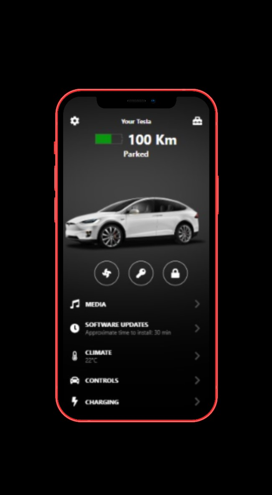

<h1 align="center">Tesla-App Clone</h1>
<h5 align="center">A frontend version of one part of the Tesla app</h5>

<br/>

## 🎯 About

I started this project with the purpose of learning and integrating React Native and other libraries. <br/>
I put a lot of effort into it and I hope that you could like it.
The App lands you to an appealing Screen, in which the user can preview his/her Tesla Car's information.
<br/><br/>
➡️ Go try it and please let me know if you enjoyed it with a ⭐️, I would appreciate it a lot.
<br/>
<br/>

## ✨ Features

✔️: &nbsp;&nbsp;Get to know about your Tesla Car<br />
✔️: &nbsp;&nbsp;FontAwesome Icons (credits: [FortAwesome/react-native-fontawesome](https://github.com/FortAwesome/react-native-fontawesome)) for the icons
<br />

## 🚀 Technologies

- [React Native](https://reactnative.dev/)
- [Font Awesome Icons](https://fontawesome.com/v5.15/how-to-use/on-the-web/using-with/react-native)
- [Expo](https://expo.dev/)
  <br/>

# 📸 Preview

<!--  -->

<br/>

<br/>

## ✅ Requirements

Before starting you need to have [Git](https://git-scm.com) and [Node](https://nodejs.org/en/) installed.

<br/>

## 🔗 Run Locally

- Clone the project

```bash
  git clone https://github.com/shivendradb/Tesla-app-clone-React-Native.git
```

- Go to the project directory

```bash
  cd Tesla-app-clone-React-Native
```

- Install dependencies

```bash
  npm install
```

- Start the server

```bash
  npm start
```

- Run on device or emulator

```bash
  Choose either "Run on Android device/emulator" or "Run on iOS simulator" as per your environment.
```

Note: <br/>
The page will reload if you make edits. <br/>
You will also see any lint errors in the console.

<br/>

#### **Please let me know if you enjoyed it with a ⭐️, I would appreciate it a lot.**
